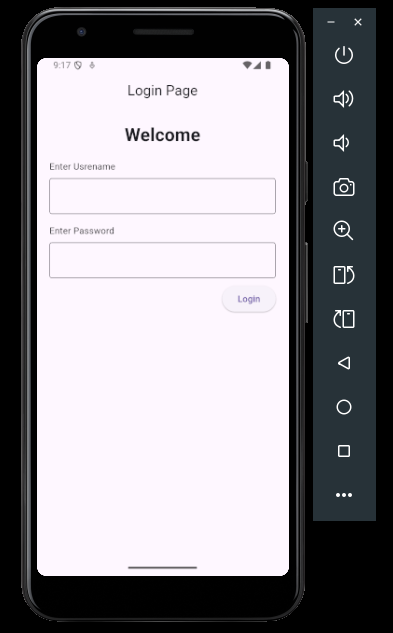

# UI Basics Lab (Flutter)

## Overview
This lab is for understanding UI basics in the Flutter framework. It focuses on how widgets are structured, how layouts are built, and how simple styling is applied.

## Learning Goals
- Understand the Flutter widget tree.
- Build basic layouts with common widgets.
- Apply simple styling and alignment.

## What to Explore
- `lib/main.dart` contains the main UI code for this lab.

## How to Run
1. Open this project in your IDE.
2. Run the app on an emulator or physical device.

## THE OUTPUT SCREENSHOT 

